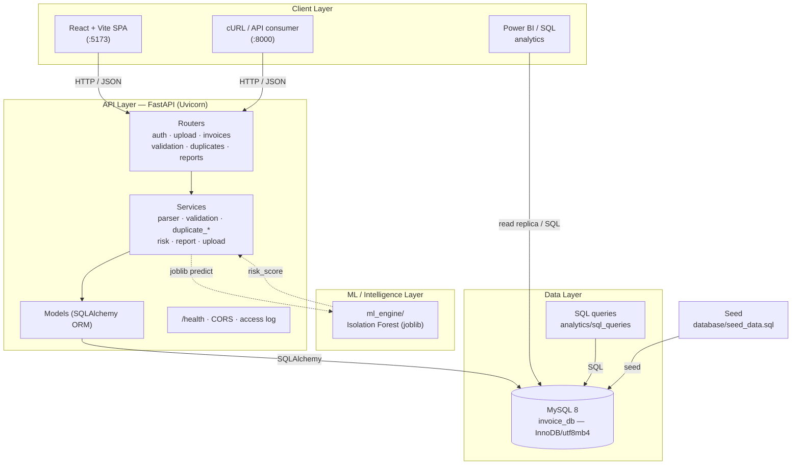
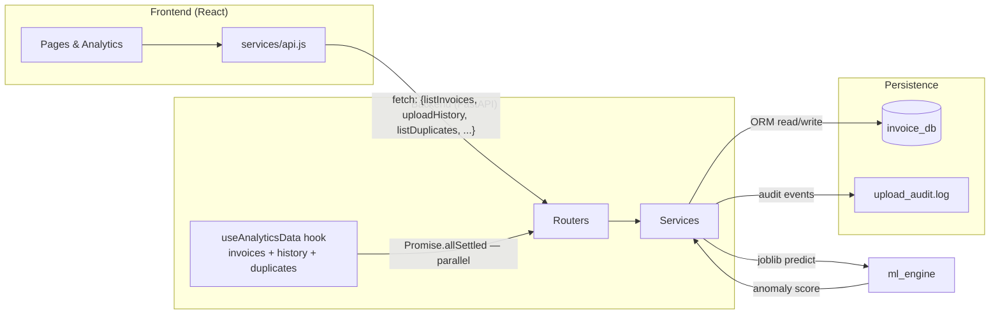
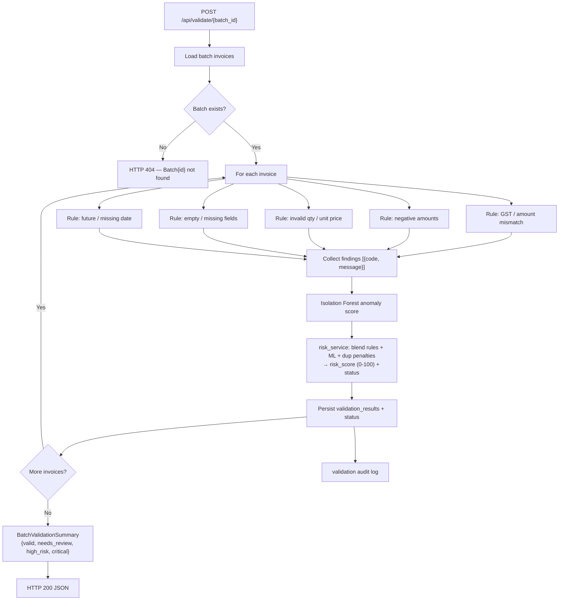
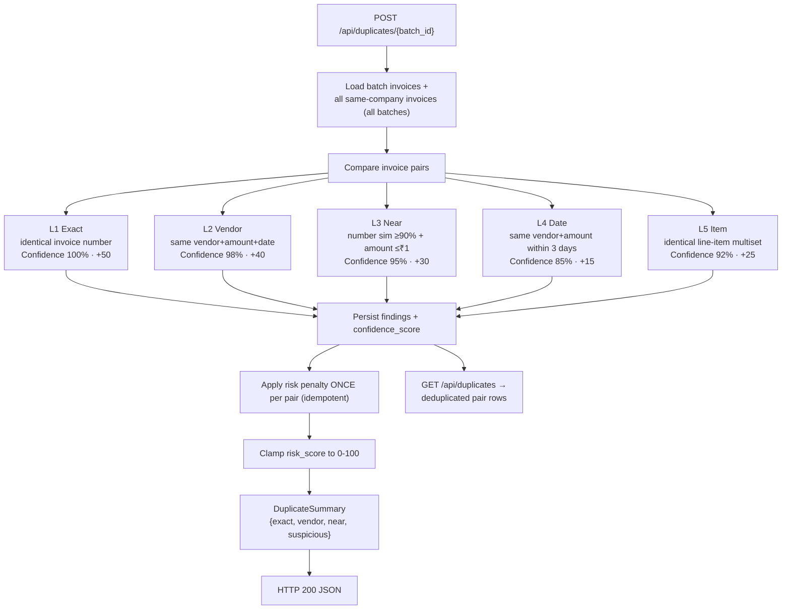
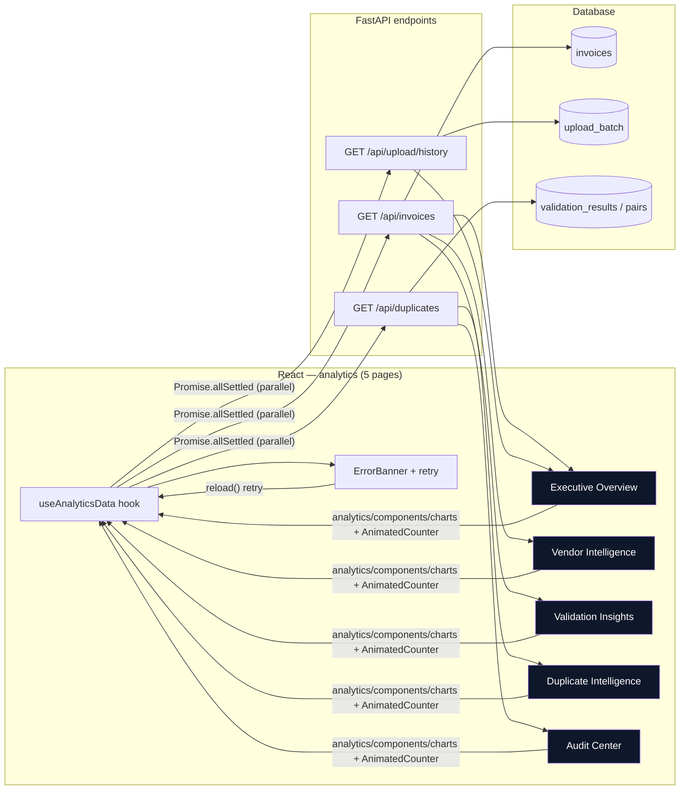

# System Architecture

> InvoiceGuard-AI v1.0.0 · A fast, explainable invoice validation and duplicate
> detection pipeline with a production-ready React frontend and FastAPI backend.

This document describes the high-level architecture, how the components
communicate, and the end-to-end data flow. Every diagram is rendered with
**[Mermaid](https://mermaid.js.org/)** and renders natively on GitHub.

---

## Table of Contents

1. [High-Level Architecture](#1-high-level-architecture)
2. [Component Communication](#2-component-communication)
3. [Upload Flow](#3-upload-flow)
4. [Validation Flow](#4-validation-flow)
5. [Duplicate Detection Flow](#5-duplicate-detection-flow)
6. [Dashboard Data Flow](#6-dashboard-data-flow)

---

## 1. High-Level Architecture



### Explanation

- **React SPA** is the primary client. It talks to the FastAPI backend over
  HTTP/JSON and is served by Vite during development (`:5173`).
- **FastAPI** exposes REST routers and orchestrates parsing, validation,
  duplicate detection, risk blending, reporting and auth through its **service**
  layer.
- **SQLAlchemy ORM** maps the models to MySQL (or SQLite for dev). All writes
  are transactional.
- **ml_engine** holds a joblib-serialised **Isolation Forest**. When present it
  supplies an anomaly signal; when absent, `predict.py` falls back to fitting on
  the incoming batch.
- **Power BI / SQL** read the same relational data for executive reporting and
  is kept deliberately read-only.

---

## 2. Component Communication



### Explanation

- The frontend routes **all** requests through one module — `frontend/src/services/api.js`
  — providing a single seam for request/response handling.
- The analytics dashboard loads invoices, upload history and duplicate pairs in
  **parallel** via `Promise.allSettled`, so one failing endpoint degrades
  gracefully instead of blanking the page.
- The backend writes to the database through the ORM and appends human-readable
  **audit events** to `backend/logs/upload_audit.log` on every upload.
- The ML engine is called **indirectly** by the risk service; its artefacts are
  optional at runtime.

---

## 3. Upload Flow

```mermaid
sequenceDiagram
    participant C as Client<br/>(React / cURL)
    participant R as Router<br/>POST /api/upload/*
    participant U as upload_service
    participant P as parser_service
    participant A as Audit log
    participant D as Database (transaction)

    C->>R: file (CSV / XLSX) via multipart
    R->>U: sanitize filename
    R->>U: stream read ≤ 20 MB; check ext + MIME (+zip magic for xlsx)
    U->>D: create batch row (status=Processing) [flush]
    U->>A: "Upload Started" / "Parsing Started"
    U->>P: parse file → standardised rows
    P-->>U: rows
    U->>A: "Parsing Completed"
    U->>D: begin_nested() savepoint
    U->>D: ensure company + vendors + invoices + items
    alt any DB error
        U->>D: roll back savepoint (NO partial invoices)
        U->>D: commit batch as Failed
        U->>A: "Upload Failed"
        U-->>R: HTTP 500 (UploadPersistError)
    else success
        U->>D: commit (batch = Completed)
        U->>A: "Save Completed" / "Upload Completed"
        U-->>R: UploadSummary {batch_id, total, processed, failed}
        R-->>C: 200 JSON
    end
```

### Explanation

- Pre-flight checks (extension, MIME, size, magic bytes) happen **before** any
  batch row is created — invalid payloads never touch the database.
- Each upload persists in **one transaction**. Invoice/vendor writes run in a
  nested **savepoint** so a fatal DB error rolls back the entire upload (no
  partial invoices), after which the batch row is committed as `Failed`.
- Every stage produces an audit event for a full, replayable trail.

---

## 4. Validation Flow



### Explanation

- Validation is **rule-first**: five hard business rules produce explicit,
  machine-readable findings (`code` + `message`) — fully auditable.
- Rules are complemented by an **ML anomaly signal** so an individually *valid*
  invoice priced far outside a vendor's history still escalates.
- `risk_service.py` merges the two into one number and status and writes the
  result back so the dashboard and reports reflect it immediately.

---

## 5. Duplicate Detection Flow



### Explanation

- Detection compares each batch invoice against **every same-company invoice
  across all batches**, catching duplicates submitted months apart.
- Five confidence levels range from **exact** (100%) to **line-item** (92%),
  each with a deterministic penalty so the impact is explainable.
- Penalties are applied **once per pair**, so re-scanning is idempotent and risk
  is clamped to 100.

---

## 6. Dashboard Data Flow



### Explanation

- All five analytics pages share a single data hook, `useAnalyticsData`, which
  loads invoices, upload history and duplicate pairs **in parallel**.
- Data is consumed by the same three read endpoints used across the app — no
  dedicated dashboard API is needed, keeping the surface small and consistent.
- `Promise.allSettled` means a single endpoint failure does not blank the page;
  the `ErrorBanner` surfaces the specific error and offers a **Retry** that calls
  `reload()`.

---

© 2026 InvoiceGuard-AI · [Back to README](../README.md)
